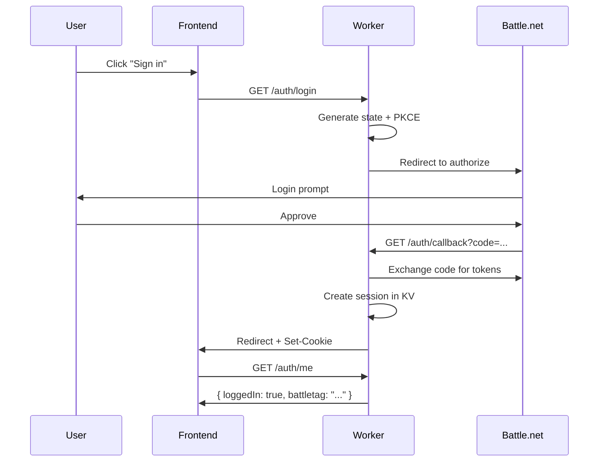

# API Reference

Quick reference for the WoW Achievement Helper API.

**Base URL:** `https://wow-achievement-helper-api.jono2411.workers.dev`

## Endpoints Overview

| Method | Endpoint | Auth | Description |
|--------|----------|------|-------------|
| GET | `/healthz` | No | Health check |
| GET | `/auth/login` | No | Start OAuth login |
| GET | `/auth/callback` | No | OAuth callback |
| GET | `/auth/me` | Cookie | Get session info |
| POST | `/auth/logout` | Cookie | End session |
| GET | `/api/manifest` | No | Full achievement catalogue |
| GET | `/api/categories` | No | Category tree (legacy) |
| GET | `/api/achievement/:id` | No | Achievement details |
| GET | `/api/realms` | No | EU realm list |
| GET | `/api/character/:realm/:name/achievements` | No | Character progress |
| GET | `/api/me/characters` | Cookie | User's characters |
| POST | `/api/me/merge` | Cookie | Merge character progress |
| GET | `/api/help/achievement/:id` | No | Strategy & comments |
| POST | `/api/admin/build-manifest` | No | Trigger manifest build |

## Authentication Flow



## Request Examples

### Get Manifest

```bash
curl https://wow-achievement-helper-api.jono2411.workers.dev/api/manifest
```

Response:
```json
{
  "categories": [
    { "id": 92, "name": "General", "children": [...] }
  ],
  "achievements": [
    { "id": 12345, "name": "...", "points": 10, "categoryId": 92, "icon": "..." }
  ],
  "builtAt": "2026-01-14T00:00:00Z"
}
```

### Get Character Progress

```bash
curl https://wow-achievement-helper-api.jono2411.workers.dev/api/character/silvermoon/charactername/achievements
```

Response:
```json
{
  "character": { "realm": "silvermoon", "name": "Charactername" },
  "completed": [12345, 67890],
  "completedAt": { "12345": 1704067200 },
  "progress": {
    "12346": { "completedCriteria": 2, "totalCriteria": 5 }
  },
  "fetchedAt": "2026-01-14T12:00:00Z"
}
```

### Get Realms

```bash
curl https://wow-achievement-helper-api.jono2411.workers.dev/api/realms
```

Response:
```json
{
  "realms": [
    { "name": "Argent Dawn", "slug": "argent-dawn" },
    { "name": "Silvermoon", "slug": "silvermoon" }
  ]
}
```

### Get Achievement Details

```bash
curl https://wow-achievement-helper-api.jono2411.workers.dev/api/achievement/12345
```

Response:
```json
{
  "id": 12345,
  "name": "Achievement Name",
  "description": "Do the thing",
  "points": 10,
  "isAccountWide": true,
  "reward": { "title": null, "item": null },
  "categoryId": 92,
  "criteria": [
    { "id": 1, "description": "Kill X", "amount": 1 }
  ],
  "icon": "achievement_icon"
}
```

### Get Help Content

```bash
curl "https://wow-achievement-helper-api.jono2411.workers.dev/api/help/achievement/12345?top=5"
```

Response:
```json
{
  "achievementId": 12345,
  "strategy": [
    { "title": "Setup", "steps": ["Step 1", "Step 2"] }
  ],
  "comments": [
    { "author": "User", "text": "Tip...", "score": null, "date": null }
  ],
  "sources": [
    { "name": "Wowhead", "url": "https://www.wowhead.com/achievement=12345" }
  ]
}
```

### Merge Characters (Authenticated)

```bash
curl -X POST \
  -H "Content-Type: application/json" \
  -b "session_id=your_session" \
  -d '{"characters":[{"realm":"silvermoon","name":"Main"},{"realm":"silvermoon","name":"Alt"}]}' \
  https://wow-achievement-helper-api.jono2411.workers.dev/api/me/merge
```

Response:
```json
{
  "merged": {
    "completed": [12345, 67890],
    "completedAt": { "12345": 1704067200 },
    "progress": { "12346": { "completedCriteria": 3, "totalCriteria": 5 } }
  },
  "sources": [
    { "realm": "silvermoon", "name": "Main" },
    { "realm": "silvermoon", "name": "Alt" }
  ],
  "fetchedAt": "2026-01-14T12:01:00Z"
}
```

## Error Responses

All errors follow this format:

```json
{
  "error": "ERROR_CODE",
  "message": "Human readable description"
}
```

### Error Codes

| Code | Status | Description |
|------|--------|-------------|
| `UNAUTHENTICATED` | 401 | Not logged in or session invalid |
| `SESSION_EXPIRED` | 401 | Session has expired |
| `NOT_PUBLIC` | 403 | Character achievements are private |
| `NOT_FOUND` | 404 | Resource not found |
| `NOT_READY` | 503 | Manifest still building |
| `RATE_LIMITED` | 429 | Too many requests |
| `UPSTREAM_ERROR` | 502 | External API error |
| `BLIZZARD_ERROR` | 502 | Blizzard API error |
| `BUILD_ERROR` | 500 | Manifest build failed |

## Caching

| Endpoint | Cache Duration |
|----------|---------------|
| `/api/manifest` | 1 hour |
| `/api/categories` | 24 hours |
| `/api/achievement/:id` | 24 hours |
| `/api/realms` | 1 hour |
| `/api/character/.../achievements` | 5 minutes |
| `/api/help/achievement/:id` | 12 hours |
| `/api/me/*` | No cache |

All cached responses include `stale-while-revalidate` for better performance.

## Rate Limits

The API proxies Blizzard's API which has these limits:
- 36,000 requests per hour
- 100 requests per second burst

The merge endpoint fetches multiple characters, so merging many characters consumes more quota.

## CORS

The API only accepts requests from:
- `https://jonwhitefang.github.io` (production)
- `http://localhost:5173` (local development)

Credentials (cookies) are allowed for authenticated endpoints.

## See Also

- [API_SPEC.md](specs/API_SPEC.md) - Detailed endpoint specifications
- [ARCHITECTURE.md](specs/ARCHITECTURE.md) - System architecture
- [TROUBLESHOOTING.md](guides/TROUBLESHOOTING.md) - Common issues
